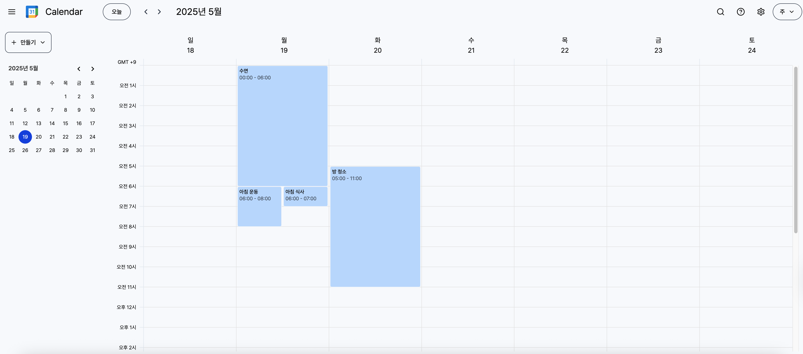

# google-calendar-clone

---

- 메인 스택: React + Vite, Tailwind CSS, Redux Toolkit, Shadcn
- 데모 링크: https://google-calendar-clone-beta.vercel.app
- 구현 내역:
  - 구글 캘린더 주별 보기 그리드
  - 일정 추가(타임블록 클릭), 일정 제거(일정 우클릭 > 삭제 버튼)
  - 주(Week)/월(Month) 반복 일정
  - 중첩 일정 표시
